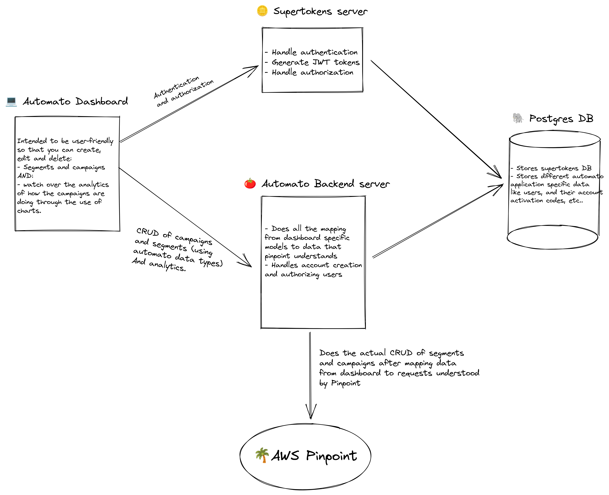

## Intro
Automato is a market automation tool that relies entirely on [AWS Pinpoint](https://aws.amazon.com/pinpoint/)
to process everything in the Backend while having a frontend dashboard that 
connects with the backend using a REST API.

The whole purpose and buisiness model of automato is to profit from the fact that Pinpoint 
is relatively unpopular so that clients (mainly buisnesses) unfamiliar with Pinpoint
use Automato instead for its ease of use and for the customer support provided
by the Automato team.

## Design
<div align="center">
    
</div>

## Implementation
Automatato is implemented using Next.JS for both the dashboard frontend and backend
and all the communication between them is done through REST API
Automato is hosted entirely on AWS EKS using Kubernetes as orchestrator and Docker
as container runtime.
We use github action for CI and ArgoCD for CD, meaning on git push we build everything
in github actions and push images to ECR registry and change image names in the [Gitops repo](https://github.com/Automa-to/gitops)
so that argocd can pickup on changes and change the production image in kubernetes.
All of this is follow the [Gitops philosophy](https://www.gitops.tech/).

## Architecture

### File structure
```
📂 src
├── 📂 api
├── 📂 components
├── 📂 pages
│   └ 📂 api
└── 📂 hooks
```
#### `📂 api/`
Contains all the API external modules such as:
- Postgres database connectors
- Pinpoint API calls,
- Cognito API calls (for creating AWS identity pools) 
- Supertokens user authentication and athorization
- Automato NEXT.js API*:
    - Server thats interfacing with all of the above modules 
    - Client code thats used from the front-end to interface with Automato server
> *Automato is not necesserally an external API but its the backend server which
process, validate and normalize all the data  that's coming from the dashboard
front-end
#### `📂 pages/`
Each file represents a dashboard route.
#### `📂 pages/api/`
All of the API routes in `src/pages/api` are processed and maped to `src/api/automato/server.ts`
#### `📂 components/`
All of the different Automato comonents. They are mainly structured by their
page route.
#### `📂 hooks/`
All of the hooks that are use in `components/`. Like the components, they are
mainly structured by their page route.
